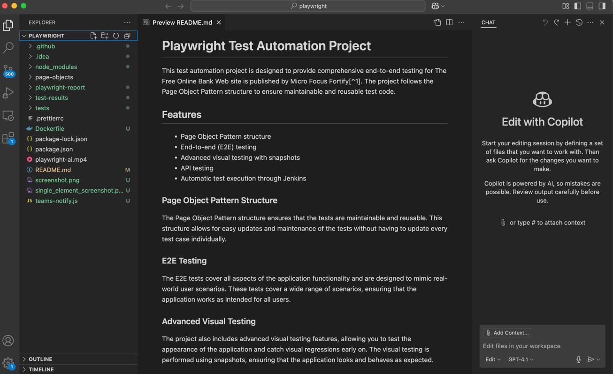

# Playwright Test Automation Project

This test automation project is designed to provide comprehensive end-to-end testing for The Free Online Bank Web site is published by Micro Focus Fortify[^1]. The project follows the Page Object Pattern structure to ensure maintainable and reusable test code.

## Features

* Page Object Pattern structure
* End-to-end (E2E) testing
* Advanced visual testing with snapshots
* API testing
* Automatic test execution through Jenkins

### Page Object Pattern Structure

The Page Object Pattern structure ensures that the tests are maintainable and reusable. This structure allows for easy updates and maintenance of the tests without having to update every test case individually.

### E2E Testing

The E2E tests cover all aspects of the application functionality and are designed to mimic real-world user scenarios. These tests cover a wide range of scenarios, ensuring that the application works as intended for all users.

### Advanced Visual Testing

The project also includes advanced visual testing features, allowing you to test the appearance of the application and catch visual regressions early on. The visual testing is performed using snapshots, ensuring that the application looks and behaves as expected.

### API Testing

In addition to E2E and visual testing, the project also includes API tests. These tests ensure that the application's APIs are working as intended, providing a comprehensive testing solution.

### Automatic Test Execution through Microsoft DevOps

The test cases can be run automatically from Microsoft DevOps providing continuous integration and continuous delivery (CI/CD) capabilities. This means that you can run your tests automatically every time you make changes to the code, ensuring that the application always works as expected.

### Playwright AI Video and Screenshot
[playwright-ai.mp4](playwright-ai.mp4)



## Integrations

### Docker

You can run the Playwright tests inside a Docker container for consistency across environments.

```bash
docker build -t playwright-tests .
docker run --rm playwright-tests
```

Make sure your `Dockerfile` is set up to install dependencies and run your tests.

### Microsoft Teams

To receive test results or notifications in Microsoft Teams, configure a Teams webhook and use a script or CI step to send messages. Example using `curl`:

```bash
curl -H 'Content-Type: application/json' -d '{"text": "Playwright tests completed!"}' <YOUR_TEAMS_WEBHOOK_URL>
```

Integrate this step after your test execution to notify your Teams channel.

### K6 (Performance Testing)

You can use [k6](https://k6.io/) for performance testing alongside Playwright. Write your k6 scripts in JavaScript and run them as follows:

```bash
k6 run script.js
```

Refer to the [k6 documentation](https://k6.io/docs/) for more details on scripting and integration.

## Conclusion

This test automation project provides comprehensive testing, including E2E tests, advanced visual testing, and API tests. The Page Object Pattern structure ensures maintainable and reusable test code, while automatic test execution through Jenkins makes it easy to integrate testing into the development workflow.

# 👨‍🔧 Try it yourself

ℹ️ _Clone or download the project and run these scripts from the project library (e.g. C:\repos\playwright>)_

**Run the tests from terminal (e.g.):** 
```shell
npm run tests:e2e
```
You can use other scripts as well as described in `.\package.json`

```json
"scripts": {
    "tests:chrome": "playwright test --config=./tests/e2e/e2e.config.ts --project=Chromium --reporter=list",
    "tests:firefox": "playwright test --config=./tests/e2e/e2e.config.ts --project=Firefox --reporter=list",
    "tests:webkit": "playwright test --config=./tests/e2e/e2e.config.ts --project=Webkit --reporter=list",
    "tests:e2e": "playwright test --config=./tests/e2e/e2e.config.ts --project=Chromium --reporter=list",
    "tests:visual": "playwright test --config=./tests/visual/visual.config.ts --project=Chromium --update-snapshots --reporter=list",
    "tests:api": "playwright test --config=./tests/api/api.config.ts --project=Chromium --reporter=list",
  },
```


[^1]: The Free Online Bank Web site is published by Micro Focus Fortify, this site is not a real banking site and any similarities to third party products and/or Web sites are purely coincidental. This site is provided "as is" without warranty of any kind, either express or implied.
